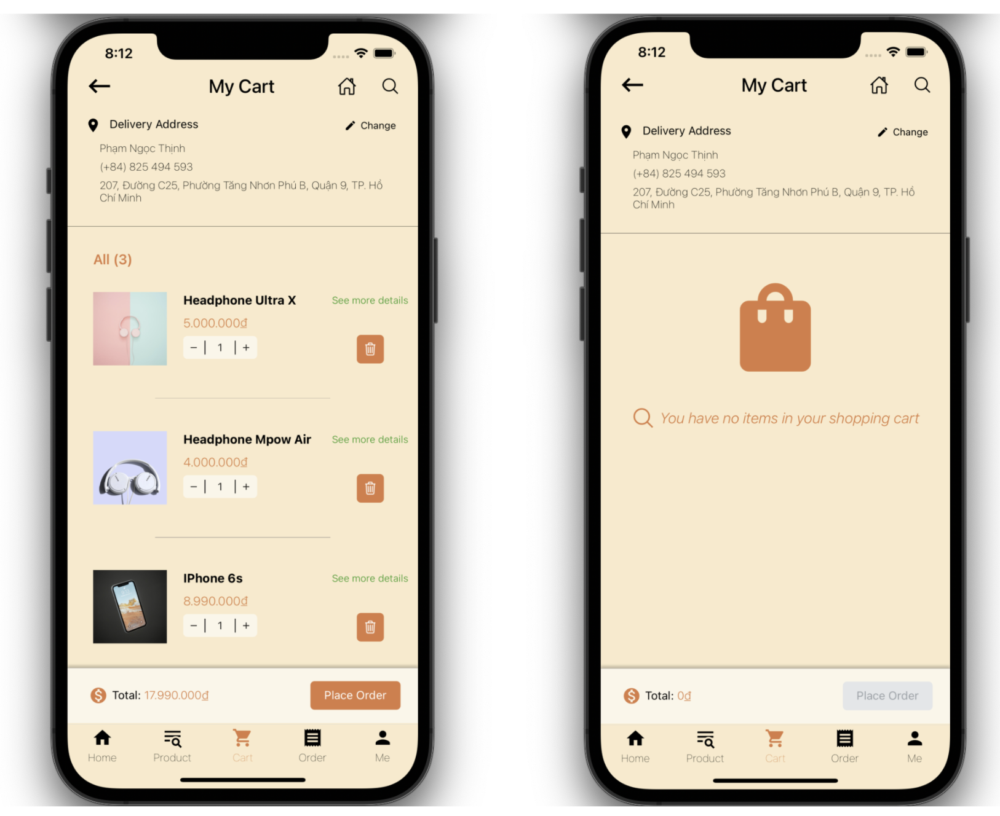

# TechShop

### `Lý do chọn đề tài:`
 * Việc mua sắm luôn luôn là một trong những nhu cầu rất thiết yếu trong đời sống của mọi người. Mua sắm online đang trở thành một trong những xu thế rất nổi bật hiện nay, nhưng việc mua sắm online sẽ dẫn đến nhiều vấn đề phát sinh. Một số chiêu trò lừa đảo xuất hiện ngày một nhiều trên các ứng dụng mua hàng online khiến người dùng khá nghi ngại khi đặt hàng thông qua các ứng dụng. 
 * Tuy nhiên, trong tình hình dịch bệnh Covid-19 căng thẳng như hiện nay, việc mua hàng online lại được nhiều người ủng hộ hơn bao giờ hết. Bởi lẽ, nhiều thành phố thực hiện chỉ thị giãn cách xã hội, hạn chế ra ngoài hết mức có thể, do đó, các ứng dụng bán hàng online được tải về và sử dụng rất nhiều. 
 * TechShop là một ứng dụng mua hàng online. TechShop ra đời nhằm cung cấp các mặt hàng liên quan đến thiết bị điện tử. Với các mặt hàng đa dạng, chất lượng đúng với giá tiền mà người sử dụng bỏ ra, TechShop mong muốn đem đến cho người dùng một trải nghiệm tốt hơn trong việc mua hàng online mà không cần nghi ngại về các chiêu trò lừa đảo.

### `Yêu cầu thiết bị:`
  * Hỗ trợ cho cả người dùng Android và iOS.
   
### `Một số màn hình ứng dụng:`
  * Trang chủ
    + Trang chủ của TechShop là nơi trưng bày một số `sản phẩm nổi bật`, được khách hàng mua nhiều trong tháng cũng như là các `chương trình khuyến mãi`.
    

    
    

  * Trang sản phẩm
    + Tất cả sản phẩm do TechShop cung cấp sẽ được phân loại tại trang sản phẩm, hỗ trợ người dùng tìm kiếm sản phẩm nhanh hơn.
    

    
    

  * Giỏ hàng 
    + Khách hàng có thể `thêm các sản phẩm muốn mua` và `tiến hành thanh toán` tại giỏ hàng
    

    
    

  * Các đơn hàng 
    + Khách hàng có thể `theo dõi tình trạng các đơn hàng` của mình trong trang này.
    

    
    

  * Trang cá nhân 
    + Khách hàng có thể thay đổi thông tin cá nhân, địa chỉ giao hàng tại trang thông tin cá nhân
    

    
    

* Đăng nhập 
    

    
    

### `Chức năng:`
  * Đăng nhập
  * Đăng xuất
  * Theo dõi các đơn hàng đã, đang và sắp được giao đến
  * Mua hàng online 
  * Huỷ đơn hàng, mua lại đơn hàng đã huỷ
  * Lưu trữ giỏ hàng
  * Lưu trữ các sản phẩm yêu thích
  * Đánh giá các sản phẩm đã mua 
  * Chỉnh sửa thông tin cá nhân
  * Chỉnh sửa thông tin giao hàng
  * Đăng ký 

### `Công nghệ và thư viện sử dụng`
  * Front-end: React Native.
  * Back-end: Java (Spring Boot).
  * Thư viện:
    + [React Navigation](https://reactnavigation.org/docs/hello-react-navigation/) 
    + [React Native Elements](https://reactnativeelements.com)

 ### `Database:`
  * MySql Server.

 ### `Công cụ:`
  - Visual Studio Code
  - Microsoft Teams: thảo luận các vấn đề liên quan đến ứng dụng.
  - GitHub: store source code of the whole project. dùng để lưu trữ toàn bộ source code của ứng dụng
  - MySQL Server.
  - Eclipse IDE for Java EE Developers.
   
 ### `Thành viên:`
  * Phạm Ngọc Thịnh - ID: 18520368 - email: 18520368@gm.edu.vn
  * Đinh Ngọc Uyên Phương - ID: 18520335 - email: 18520335@gm.edu.vn